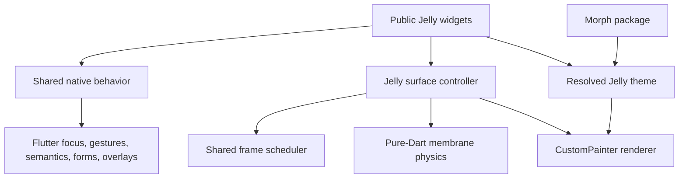

# Jelly UI Flutter package blueprint

Status: proposed architecture and design-system plan  
Research snapshot: 2026-08-13  
Source baseline: `henryhawke/jelly-ui@8e39a8e61b5a43a562ae85e4b01191d333d5b121`  
Target Flutter toolchain used for this plan: Flutter 3.44.5 / Dart 3.12.2

This is the stage-one deliverable. It deliberately contains no Flutter implementation. The next stage should begin only after the public interface, package topology, morph boundary, and performance budgets are accepted.

## Executive decision

Rebuild Jelly UI as a Flutter-first design-system package, not as a mechanical translation of Web Components.

The port should preserve the existing product's strongest idea: native controls and accessibility wrapped in real soft-body surfaces. Flutter owns layout, focus, keyboard input, gestures, semantics, text editing, overlays, and platform adaptation. Jelly owns the soft-body simulation, its frame scheduler, surface painting, motion policy, and a small family of familiar Flutter widgets.

Visual design languages become compile-time **morph packages**. A morph is a declarative, immutable set of visual instructions. It may change tokens, typography, geometry, state recipes, shadows, borders, focus treatment, and paint layers. It may not replace a widget's behavior, semantics, gesture recognizers, value model, or soft-body simulation.

The first morph should be `jelly_morph_neobrutalism`, based on the canonical FartUI Instrument references in `~/Desktop/fartwithfriends/fartui/`. It combines FartUI's printed-hardware visual grammar with Jelly's existing interactive membrane. It does not copy Fart With Friends product concepts such as the Charge, four bays, ambient gas, or app-specific vocabulary into this general-purpose package.

The main package should have no third-party runtime dependency in v1 beyond the Flutter SDK. Morphs are separate optional Flutter packages. Developer tooling may have dev dependencies.

## Goals

1. Familiar Flutter interfaces: `value`/`onChanged`, controllers where Flutter uses controllers, nullable callbacks for disabled states, `WidgetState`, and normal `FocusNode`, semantics, and form integration.
2. One-import, one-theme setup with useful defaults.
3. A real, stable morph seam that lets third parties ship coherent design languages without forking widgets.
4. Soft-body feedback that looks physically connected to the pointer and settles naturally at 60 Hz and 120 Hz.
5. No persistent ticker after a surface has settled.
6. No build or layout work in the per-frame membrane hot path.
7. Accessibility as behavior, not documentation: keyboard, focus, semantics, RTL, large text, high contrast, reduced motion, and adequate targets.
8. A complete isolated catalog for all widget states and morph combinations.
9. Measured performance gates on the oldest supported physical devices.
10. A migration path for all 38 existing component families without preserving browser-specific interface baggage.

## Non-goals

- A runtime plugin loader or string-keyed registry. Dart packages are statically imported and tree-shaken.
- A general-purpose styling DSL comparable in breadth to CSS or Mix.
- A state-management package. Jelly widgets remain state-management agnostic.
- A platform channel plugin. The core is a Flutter/Dart package; haptics use Flutter services only when a caller explicitly opts in.
- A shader-heavy liquid-glass system. The signature effect is a painted membrane, not blur, refraction, or `saveLayer` compositing.
- Pixel-identical rendering of the old website. Behavioral and physics parity matter; Flutter conventions replace DOM conventions.
- Importing FartUI's product shell, copy, jokes, permissions, privacy rules, or domain-specific components into a reusable morph.

## What exists today

The cloned source is a strict TypeScript Web Components library with a single ESM bundle, 38 component directories, 40 test files, a shared requestAnimationFrame engine, canvas-backed soft-body surfaces, CSS custom-property theming, real browser tests, and a generated Custom Elements manifest.

The architecture graph identifies three high-fan-in modules worth preserving conceptually:

- `JellyElement.requestFrame` is called from 54 sites.
- `JellyElement` centralizes canvas sizing, input mapping, theme repainting, focus rings, and common painting.
- `theme` supplies shared semantic tokens.

The physics core already includes several sound decisions:

- A uniformly sampled rounded-rectangle membrane.
- Neighbor coupling, pressure, volume correction, depth, tilt, and pointer impulses.
- Delta clamping and substeps to prevent a late frame injecting energy.
- A shared scheduler that parks when every body reports rest.
- Synchronous repaint after resize to avoid blank frames.
- Device-pixel-ratio capping.
- Reduced-motion handling and native content layered above a canvas surface.

The port should preserve those behaviors while replacing object-heavy JavaScript data structures and DOM-specific machinery.

### Existing component inventory

Foundation and display:

- Theme, card, badge, chip, divider, label, keyboard key, alert, skeleton, spinner, progress.

Actions and choice:

- Button, icon button, checkbox, radio, radio group, switch, segmented, segment.

Fields:

- Input, textarea, OTP, select, option, slider, range.

Disclosure and layout:

- Accordion, collapsible, tabs, resizable.

Navigation and overlays:

- Breadcrumbs, pagination, dialog, drawer, menu, popover, toast, tooltip.

No family is silently dropped. Each will either become a public Flutter widget, become an internal part of a compound widget (`option`, `segment`), or receive an explicit deprecation rationale during implementation.

## Research cohort and critical takeaways

“Top” is not treated as a synonym for raw stars. The cohort includes highly adopted libraries, coherent platform implementations, design-system infrastructure, animation/physics specialists, and libraries that expose instructive limitations. Star counts are a GitHub snapshot from 2026-08-13 and will change.

| Project | Snapshot | What it demonstrates | Adopt | Do not copy |
| --- | ---: | --- | --- | --- |
| Flutter Material/Cupertino | Flutter 178k stars | Native semantics, state models, platform integration, component-specific theme data | Familiar widget conventions and native primitives underneath Jelly | Forking framework controls wholesale |
| GetWidget | 4.8k | Huge drop-in catalog and consistent naming | Easy discovery and uniform state/size vocabulary | A 1,000-property breadth race or shallow wrappers |
| fluent_ui | 3.5k | A coherent design language can own an entire Flutter widget suite | Cohesion and explicit theme root | Coupling Jelly semantics to one desktop platform |
| Flutter Shadcn UI | 2.8k | Broad, composable, highly customizable widget set | Compound widgets, clear variants, strong catalog | Per-widget escape hatches that bypass global guarantees |
| Forui | 2.3k | 40+ tested widgets, generated theme boilerplate, theme builder, companion packages | Monorepo separation, catalog quality, eventual morph builder | Requiring hooks, codegen, or a large dependency for basic use |
| macos_ui | 2.1k | Platform-faithful theme access and complete interaction patterns | A single coherent theme lookup and keyboard-aware controls | Treating visual fidelity as permission to replace native semantics |
| FlexColorScheme | 1.2k | Standard `ThemeData` output plus a visual theme builder | Generate ordinary Flutter theme objects; add a future Morph Studio | Hundreds of knobs in the runtime widget interface |
| flutter_animate | 1.1k | Immutable reusable effects and external progress adapters | Immutable motion descriptions and testable external drivers | Making generic effect chains the membrane engine |
| shadcn_flutter | 924 | A second serious shadcn implementation with a cohesive ecosystem | Validate component composition from multiple implementations | Let two competing public vocabularies emerge in Jelly |
| Widgetbook | 942 | Isolated hard-to-reach states, device/theme/text-scale catalogs, visual review | A first-class component laboratory and state matrix | Treating screenshots as behavioral or device-performance proof |
| Mix | 798 | Typed style separation, token resolution, contextual variants | Resolve immutable style data outside the hot paint loop | A public general-purpose style DSL and runtime property sprawl |
| Dough | 748 | Demand for pressable, draggable, gyro, and custom “smooshy” widgets | Interaction should feel directly connected to input | Whole-child rubber-band transforms as a substitute for membrane physics |
| NeoPOP | 457 | Physical depth, multi-surface buttons, short press feedback | Study physical depth and state timing | Its five-surface model and many per-button color arguments |
| Moon Flutter | 321 | `ThemeExtension`, token copies, component-level theme overrides | Typed interpolation and a narrow override path | Its v1 inflexibility; the project itself says wrappers are needed |

Primary repositories:

- https://github.com/flutter/flutter
- https://github.com/ionicfirebaseapp/getwidget
- https://github.com/bdlukaa/fluent_ui
- https://github.com/nank1ro/flutter-shadcn-ui
- https://github.com/duobaseio/forui
- https://github.com/macosui/macos_ui
- https://github.com/rydmike/flex_color_scheme
- https://github.com/gskinner/flutter_animate
- https://github.com/sunarya-thito/shadcn_flutter
- https://github.com/widgetbook/widgetbook
- https://github.com/conceptadev/mix
- https://github.com/josiahsrc/dough
- https://github.com/CRED-CLUB/neopop-flutter
- https://github.com/coingaming/moon_flutter

### Conclusions from the cohort

1. Token-only theming is insufficient. Moon v1 is direct evidence: colors and typography without flexible component recipes eventually force wrappers.
2. Unbounded component overrides are also insufficient. They make each widget a styling island and make global morph guarantees untestable.
3. Jelly needs an intermediate layer: a small set of semantic **surface roles** resolved into immutable paint recipes.
4. A visual builder is valuable, but it should generate normal Dart theme objects; it should not introduce a runtime schema interpreter.
5. A component catalog is part of the product, not sample code.
6. Animation libraries optimize generic composition. Jelly should keep its specialized shared scheduler and physics engine, while borrowing immutable descriptions and external progress adapters.

## Official Flutter constraints

The architecture follows these current Flutter guarantees and warnings:

- `ThemeExtension` is Flutter's supported seam for additions to `ThemeData`; `lerp` enables smooth theme transitions: https://api.flutter.dev/flutter/material/ThemeExtension-class.html
- `CustomPainter(repaint: listenable)` can repaint without running build or layout: https://api.flutter.dev/flutter/rendering/CustomPainter-class.html
- `RepaintBoundary` isolates display lists but adds layer/memory overhead, so boundaries must be measured rather than sprayed everywhere: https://api.flutter.dev/flutter/widgets/RepaintBoundary-class.html
- Flutter targets 60 Hz and 120 Hz. A 120 Hz frame has roughly 8.33 ms: https://docs.flutter.dev/tools/devtools/performance
- Avoid intrinsic layout on frequently used paths, excessive clipping, opacity layers, and `saveLayer`: https://docs.flutter.dev/perf/best-practices and https://docs.flutter.dev/perf/ui-performance
- Impeller precompiles a constrained shader set and is the only supported iOS renderer; Android may fall back on older devices: https://docs.flutter.dev/perf/impeller
- Android's disable-animation flag and iOS's reduce-motion flag are not the same value. Custom motion policy must combine `MediaQueryData.disableAnimations` with `PlatformDispatcher.accessibilityFeatures.reduceMotion`: https://api.flutter.dev/flutter/widgets/MediaQueryData/disableAnimations.html and https://api.flutter.dev/flutter/dart-ui/AccessibilityFeatures/reduceMotion.html
- A `Ticker` is silenced by `TickerMode`, but elapsed time continues. Truth-bearing timers must use a monotonic `Stopwatch`, not tick counts: https://api.flutter.dev/flutter/scheduler/Ticker-class.html
- Flutter packages should expose one library entry point and put implementation under `lib/src`: https://docs.flutter.dev/packages-and-plugins/developing-packages

## Design laws

1. **Behavior is invariant across morphs.** A button remains a button; a switch remains a switch.
2. **Morphs are visual instructions, not widget factories.** They cannot inject gestures, semantics, controllers, async work, or app state.
3. **Physics is a separate policy from visual language.** Apps may tune motion globally, but a morph cannot silently change what a gesture means.
4. **The hot path is allocation-free after warmup.** No per-frame lists, maps, closures, path-point objects, or theme resolution.
5. **Only active surfaces tick.** Settled bodies unregister. Ambient infinite wobble is never the default.
6. **The painter never owns accessibility.** A stable Flutter semantics subtree sits above or around it.
7. **Content stays legible.** The background membrane deforms; text and icons may receive a small rigid translation/rotation but are never mesh-warped.
8. **Touch targets do not deform.** Hit testing uses the stable control box and Flutter's gesture arena.
9. **Reduced motion loses interpolation, not information.** State, focus, progress, and labels remain complete.
10. **Performance claims require profile-mode traces on target hardware.** A simulator or debug build is not evidence.
11. **Defaults are excellent and short.** Advanced customization lives in theme construction, not dozens of widget parameters.
12. **Every public type must earn its keep.** Internal painter and simulation seams stay private until at least two real adapters need them.

## Proposed repository topology

```text
jelly-ui/
  packages/
    jelly_ui/                       # public Flutter package
      lib/
        jelly_ui.dart               # curated public exports
        src/
          components/               # public widgets, private implementations
          foundation/               # theme lookup, states, intents, sizes
          motion/                   # scheduler, controller, policies
          physics/                  # pure-Dart membrane and integration
          rendering/                # painter, geometry cache, paint cache
          semantics/                # shared control behavior helpers
      test/
      benchmark/
    jelly_morph_neobrutalism/       # optional first-party morph
      lib/
      assets/fonts/
      test/
    jelly_ui_test/                  # public test helpers and matchers
      lib/
  apps/
    catalog/                        # Widgetbook or equivalent isolated catalog
    benchmark_gallery/              # macrobenchmark app, no demo-only shortcuts
  docs/
  tool/
```

Use a Dart workspace and Melos only if its orchestration value exceeds the maintenance cost. Consumers must not depend on Melos.

`jelly_ui` was not registered on pub.dev when checked through the public package API on 2026-08-13 (HTTP 404). Recheck immediately before publication; a plan is not a reservation.

### Why the physics core remains inside `jelly_ui`

The pure-Dart physics folder is an internal module, not a second published package in v1. There is only one real adapter: Jelly's Flutter painter. Publishing it would create a hypothetical seam, force early compatibility commitments, and make simple installation more complex. Extract it only when a second non-Flutter or independent rendering adapter actually exists.

### Dependency direction



No arrow points from physics or rendering back into widgets. No morph package imports `lib/src`.

## Public interface: recommended hybrid

Three interface shapes were evaluated:

1. **Minimal:** a single resolved `JellyThemeData` object installed in `ThemeData`. Deep and fast, but third-party authors must manually construct a large value object.
2. **Maximum flexibility:** composable layers and per-role adapters. Powerful, but it exposes internal seams, complicates interpolation, and invites hot-loop callbacks.
3. **Common-case first:** a morph factory plus one theme installation helper. Excellent caller ergonomics, but weak on its own unless the resolved contract is explicit.

Use a hybrid: a tiny caller interface, an immutable declarative authoring value, and one compiled internal representation. The morph itself is final data rather than an overridable callback surface.

```dart
@immutable
final class JellyMorph {
  const JellyMorph({
    required this.id,
    required this.standard,
    this.dark,
    this.highContrast,
    this.highContrastDark,
  });

  final String id;
  final JellyMorphTheme standard;
  final JellyMorphTheme? dark;
  final JellyMorphTheme? highContrast;
  final JellyMorphTheme? highContrastDark;
}

@immutable
final class JellyThemeData extends ThemeExtension<JellyThemeData> {
  const JellyThemeData({
    required this.morph,
    this.motion = const JellyMotionSettings.adaptive(),
    this.feedback = const JellyFeedbackSettings.platform(),
  });

  final JellyMorphTheme morph;
  final JellyMotionSettings motion;
  final JellyFeedbackSettings feedback;

  @override
  JellyThemeData copyWith({...});

  @override
  JellyThemeData lerp(covariant JellyThemeData? other, double t);
}
```

`JellyMorphTheme` is immutable authoring data. It contains no `BuildContext`, widget builders, closures, or mutable caches. `JellyTheme.material` validates it, selects the brightness/contrast variant, and compiles private paint-ready data during theme construction—not during paint. Every third-party package therefore uses the same concrete `ThemeExtension` type; a subclass-per-morph design would fragment lookup and interpolation.

The common case should read:

```dart
import 'package:jelly_ui/jelly_ui.dart';
import 'package:jelly_morph_neobrutalism/jelly_morph_neobrutalism.dart';

MaterialApp(
  theme: JellyTheme.material(
    base: ThemeData.light(),
    morph: JellyNeoBrutalism.instrument,
  ),
  home: const ExampleScreen(),
);
```

Widget use remains ordinary Flutter:

```dart
JellyButton(
  onPressed: save,
  variant: JellyButtonVariant.primary,
  child: const Text('Save'),
)
```

Local scoping remains possible without changing `MaterialApp`:

```dart
JellyTheme(
  data: JellyTheme.of(context).copyWith(
    motion: const JellyMotionSettings.reduced(),
  ),
  child: const PreviewPanel(),
)
```

### Interface invariants

- `JellyTheme.material` always returns ordinary `ThemeData` with one `JellyThemeData` extension.
- Missing extension data resolves to a documented neutral fallback so a lone `JellyButton` still works. Debug mode emits one diagnostic, not one per build.
- Duplicate morph role ids, invalid radii, negative strokes, non-finite values, or missing required semantic roles fail at theme construction in debug/test.
- Release builds sanitize bounded numeric values and use a safe fallback recipe rather than crashing in paint.
- Theme interpolation happens between resolved data. A morph object itself is never interpolated.
- Switching between incompatible paint-layer topologies cross-fades at the surface boundary; compatible recipes interpolate field by field.
- No morph method is invoked per frame.

## Token and recipe model

The model has three layers. Skipping a layer creates either hardcoded components or token sprawl.

### 1. Primitive tokens

Raw values with no UI meaning:

- Color swatches.
- Spacing scale.
- Corner-radius scale.
- Stroke-width scale.
- Depth/shadow-offset scale.
- Typography scale.
- Motion durations, curves, and spring presets.

### 2. Semantic tokens

Purpose rather than appearance:

- `canvas`, `surface`, `surfaceRaised`, `surfaceInset`.
- `textStrong`, `textMuted`, `textOnAction`.
- `action`, `information`, `success`, `warning`, `danger`.
- `border`, `borderStrong`, `focus`, `shadow`.
- `disabledSurface`, `disabledForeground`.

### 3. Surface-role recipes

A deliberately small set shared by 38 widgets:

- `actionSurface`
- `quietActionSurface`
- `containerSurface`
- `fieldSurface`
- `choiceIndicator`
- `movableThumb`
- `selectionTrack`
- `overlaySurface`
- `statusSurface`
- `progressSurface`
- `focusTreatment`
- `disabledTreatment`

Each recipe contains typed state values, not arbitrary maps:

```dart
@immutable
final class JellySurfaceRecipe {
  const JellySurfaceRecipe({
    required this.fill,
    required this.foreground,
    required this.border,
    required this.radius,
    required this.depth,
    required this.pressed,
    required this.focused,
    required this.disabled,
    this.layers = const <JellyPaintLayer>[],
  });
}
```

Public recipes describe outcomes. Private compiled recipes cache `Paint`, resolved colors, numeric state tables, and compatible layer interpolators.

### Why not per-component theme classes for everything

Thirty-eight theme classes would expose nearly as much interface as the implementation. Most widgets need the same few visual ideas: field, action, container, indicator, thumb, track, and overlay. Create a component-specific theme only when a widget has real irreducible structure, such as dialog barriers or a range track with two thumbs.

### Why not a `Map<String, dynamic>`

It loses exhaustiveness, interpolation safety, IDE discovery, tree shaking, and compile-time compatibility. A morph is Dart code with typed immutable values.

## Morph package contract

A morph package:

1. Depends on `jelly_ui` through its public interface only.
2. Exposes one or more immutable `JellyMorph` presets.
3. Resolves every required semantic token and surface role.
4. Declares a stable `id` and supported morph-contract major version.
5. Supplies interpolation-compatible light/high-contrast variants or explicitly declares a discrete transition.
6. Includes catalog fixtures and validation tests.
7. Does not import application state, platform plugins, networking, or routing.
8. Does not install global singletons or static mutable registries.
9. Does not define gesture recognizers, semantics nodes, or value controllers.
10. Performs no I/O, asynchronous work, or environment lookup during construction.

“Plugin” therefore means an imported adapter at a typed compile-time seam. It does not mean runtime discovery.

### Extensibility levels

**Stable level 1: data recipes.** Covers colors, type, geometry, shadows, state transitions, and a constrained paint-layer algebra. This is the default and must cover neobrutalism.

**Experimental level 2: custom decoration painter.** Consider only after two first-party morphs prove the paint-layer algebra insufficient. If introduced, it receives immutable geometry and preallocated scratch/cache objects, may paint only behind/in front of the surface, and cannot participate in hit testing or semantics. It must carry an explicit performance warning and benchmark fixture.

Do not publish level 2 in the first release merely to feel extensible.

## Motion and physics architecture

### Runtime flow

```text
Pointer / keyboard state
  -> JellySurfaceController applies target/impulse
  -> JellyFrameScheduler wakes controller
  -> scheduler ticks active controllers only
  -> membrane integrates in bounded substeps
  -> controller notifies painter
  -> CustomPainter repaints its isolated surface
  -> controller unregisters after rest tolerance is met
```

The widget tree does not rebuild on each frame. Content and semantics remain stable.

### Scheduler

Port the existing shared-engine idea into a `JellyMotionScope` with one `Ticker` and an insertion-stable active set.

- `wake(controller)` registers and starts the ticker if parked.
- `drop(controller)` unregisters on dispose.
- A controller returns `true` while physics or color interpolation remains active.
- The ticker stops when the active set is empty.
- Iteration is safe against controllers unregistering during a frame.
- A bad controller is isolated in debug diagnostics; one surface must not stop all others.
- Offstage/TickerMode-muted surfaces keep correct elapsed truth but do not spend paint work.

Do not give each idle widget its own live `AnimationController`.

### Simulation data layout

Replace arrays of `MembranePoint` objects with a preallocated structure-of-arrays:

```text
Float32List restX, restY
Float32List normalX, normalY
Float32List displacement, velocity
Float32List depth, depthVelocity
Float32List projectedX, projectedY
Float32List scratchA, scratchB
```

Benefits:

- Contiguous access and fewer pointer chases.
- Zero per-point object allocation.
- Reusable projection and normal scratch buffers.
- Straightforward bounds assertions in debug builds.
- A deterministic pure-Dart unit-test surface.

### Integration

Start by matching the source algorithm, then optimize from measured traces.

- Clamp a resumed frame delta to 33 ms.
- Subdivide any integration step above the calibrated stability ceiling.
- Use a monotonic elapsed source.
- Cap catch-up work; never try to simulate seconds of suspended time.
- Recompute geometry only when logical size, radius, quality, or text-direction-relevant shape changes.
- Preserve input impulses across 60/90/120 Hz by scaling forces in seconds, not frames.
- Establish deterministic tolerances for rest position and velocity.
- Compare trajectories at 60, 90, and 120 Hz; final displacement and settling time must remain within a documented envelope.

A fixed 120 Hz simulation with render interpolation is a candidate, not an assumption. Benchmark it against bounded variable substeps before choosing. It may double CPU cost on 60 Hz devices without perceptible benefit.

### Quality tiers

Sample count is a performance lever, not a user-facing style knob.

- `compact`: small indicators and thumbs.
- `standard`: buttons, fields, chips, cards.
- `hero`: unusually large interactive surfaces.

Exact counts remain provisional until device benchmarks. The current web default of 240 samples must not be copied blindly. Size changes rebuild the ring outside the normal paint loop.

Interactive bodies always outrank ambient decoration. The package should not silently reduce the directly touched body's quality when many surfaces animate.

### Paint layers

The core renderer owns a stable layer order:

1. Back decoration and shadow.
2. Deformed fill.
3. Deformed border.
4. Optional front decoration.
5. Focus treatment.
6. Rigid child content in the widget tree.

The painter reuses `Path` and `Paint` objects, calls `Path.reset`, and never calls `saveLayer` in standard morphs. Morph resolution compiles colors and strokes before animation begins.

### Shape and content

- The surface is a rounded rectangle; circle and capsule are special cases.
- Deformation can overflow into bounded paint padding without changing layout.
- The stable control box owns hit testing and minimum target size.
- The child may translate/rotate with the body's rigid center state.
- Text, icons, editable text, carets, selections, and semantics are never warped through the membrane mesh.
- Clipping is opt-in. Default jelly overflow should not use `Clip.antiAliasWithSaveLayer`.

### Truth-bearing progress

Recording duration, hold duration, media progress, and other user-facing facts are read from a monotonic `Stopwatch`. A ticker invalidates visuals; it is not the clock. Where a terminal transition must happen while ticks are muted, use a coarse timer or lifecycle reconciliation with a generation token.

## Motion policy and accessibility

`JellyMotionSettings` is independent of morph data:

- `adaptive`: full motion unless the platform requests reduction.
- `reduced`: retain instant state deformation/color/position, remove spatial oscillation, tilt, parallax, repeated breathing, and decorative travel.
- `none`: deterministic test/debug policy, never selected automatically for all accessibility cases.
- Tuned advanced settings are constructed at theme level, not on every widget.

Adaptive reduction is true when either:

```dart
MediaQuery.disableAnimationsOf(context) ||
WidgetsBinding.instance.platformDispatcher.accessibilityFeatures.reduceMotion
```

The implementation must listen for accessibility-feature changes, not capture the flag once at startup.

Reduced motion rules:

- State and progress still update.
- Press/focus/selection remains visually unambiguous.
- A pressed surface may change immediately, but does not wobble after release.
- Decorative loops stop.
- Route and overlay travel becomes a short fade or instant replacement according to user settings.
- Haptics are not a substitute for semantics and are controlled separately.

Other accessibility requirements:

- Minimum interactive target: 48 logical pixels by default, while allowing a smaller painted mark inside.
- Keyboard activation uses Flutter `Actions`/`Shortcuts` and `FocusableActionDetector` where a native control is not already used.
- Focus is always visible and morph-defined, but its presence and timing are invariant.
- Every state has a non-color cue.
- Text scale at 1.0, 1.5, and 2.0; compact-width and RTL fixtures are mandatory.
- High contrast resolves through a dedicated environment flag, not color guessing in paint.
- Custom painters contribute no duplicate semantics for ordinary controls.
- Overlay focus trapping and restoration use Flutter's focus system.

## Component interface rules

### Shared conventions

- `onPressed`/`onChanged == null` means disabled.
- Controlled widgets use `value` and `onChanged`.
- Editable text uses Flutter `TextEditingController`, `FocusNode`, formatters, autofill, and restoration.
- Variants are small enums with semantic names, not raw colors.
- Sizes are a small `JellyControlSize` enum plus layout constraints; arbitrary padding is a deliberate escape hatch on containers only.
- Loading is explicit and preserves dimensions.
- Error state uses visible copy and semantics; a morph supplies appearance.
- `semanticLabel`, `tooltip`, `autofocus`, and `focusNode` follow Flutter norms.
- Every widget works without Riverpod, Provider, Bloc, hooks, code generation, or extension-method magic.

### Use native behavior beneath Jelly

Examples:

- Button: shared focus/actions/semantics behavior with a Jelly surface; do not reimplement key activation ad hoc in every button.
- Checkbox/radio/switch: controlled state and native semantics, custom painted indicator.
- Text field/textarea/OTP: compose `EditableText`/`TextField` behavior, selection, input methods, autofill, and form validation. Never build a text editor.
- Slider/range: use Flutter gesture semantics and value math; Jelly owns thumb/track visuals.
- Dialog/drawer/menu/popover/tooltip/toast: use `Overlay`, `OverlayPortal`, routes, focus scopes, dismissal, barriers, and semantic announcements correctly.
- Tabs/accordion/collapsible: compound widgets with explicit controllers only where caller coordination is useful.

### Component rollout

1. **Foundation:** theme, surface, motion scope, focus, tokens, intents, sizes.
2. **Primitive display:** card, badge, chip, divider, label, keyboard key, alert.
3. **Actions:** button, icon button.
4. **Choice controls:** checkbox, radio/group, switch, segmented/segment.
5. **Fields:** input, textarea, OTP, select/option, slider, range.
6. **Feedback:** progress, skeleton, spinner, toast.
7. **Disclosure/layout:** accordion, collapsible, tabs, resizable.
8. **Overlays/navigation:** dialog, drawer, menu, popover, tooltip, breadcrumbs, pagination.

Build vertical slices through semantics, interaction, painter, morph, catalog, tests, and performance. Do not create 38 visual shells first and postpone behavior.

## Neobrutalism morph specification

Canonical authority for the target appearance:

- `~/Desktop/fartwithfriends/fartui/SKILL.md`
- `~/Desktop/fartwithfriends/fartui/references/visual-system.md`
- `~/Desktop/fartwithfriends/fartui/references/components.md`
- `~/Desktop/fartwithfriends/fartui/references/motion-and-interaction.md`
- `~/Desktop/fartwithfriends/fartui/references/implementation-and-audit.md`

The target is the documented Instrument language. Current Flutter compatibility layers and retired liquid-glass/toxic-candy code are not authority.

### Visual thesis

Printed hardware: saturated candy plastic on a sky-blue chassis, hard black keylines, and solid offset shadows with zero blur. No structural gradient, translucency, glow, blur, bevel, or glossy highlight.

### Primitive palette

| Token | Value | General morph role |
| --- | --- | --- |
| `ink` | `#14120F` | text, borders, focus, hard shadow |
| `sky` | `#00AEFF` | canvas / information identity |
| `paper` | `#FFFDF6` | surfaces |
| `bone` | `#EDEAD8` | inset/disabled surfaces |
| `lime` | `#00FF52` | primary action/success |
| `cyan` | `#00FFFF` | information/selection |
| `jade` | `#00DE94` | secondary positive/accent |
| `magenta` | `#FF2FD0` | live/danger/social accent |
| `deepsky` | `#0090CC` | links and quiet information |

No feature-local hex values. Derived colors must be named, constrained, and documented. Normal text on `sky` and `magenta` uses `ink`; color is never the only state cue.

### Typography

- Display, identity, and readouts: bundled variable Archivo at width axis 125.
- Interface copy: bundled Public Sans.
- Updating numerals use `FontFeature.tabularFigures()`.
- Instrument-label recipe: 9 px, weight 800, uppercase, approximately 0.2 em tracking.
- Package fonts require license files and attribution in the morph package.
- Font assets are bundled by the morph so a developer does not edit the app's pubspec for the default look.

The morph exposes general typographic roles. It does not force FartUI-specific words or uppercase every button.

### Geometry

- Stroke scale: 1.5, 2, 2.5, 3, 4, 5 logical pixels.
- Default component border: 3.
- Radius scale begins at 12; common controls use 12–20, sheets 24–27, pills use a stadium radius.
- Depth offsets: 2, 3, 4, 5, 6, 8.
- Default full control height: 54; painted icon key 42 inside a 48 target.
- Standard horizontal gutter token: 24.

### Deformed hard shadow

For a Jelly surface, draw the same deformed path once in `ink` at the depth offset, then draw the fill and border at the origin. This keeps the shadow zero-blur and physically attached to the wobble.

Pressed state:

- Translate the rigid surface/content by 1 px in the shadow direction.
- Reduce shadow offset by 1 px.
- Continue the local membrane response under the pointer.
- Do not add a generic scale or opacity press effect.

This is the intentional hybrid: FartUI's depth law remains readable while Jelly's local bulge, dent, ripple, and settling remain alive. A morph changes the material; it does not turn Jelly off.

Shadowless flat rows change fill to `cyan` instead of translating. Disabled controls remove depth because depth means pressable.

### State recipes

- Default: opaque token fill, ink border, tiered hard shadow.
- Pressed: instant 1 px sink plus Jelly deformation.
- Hover: a documented fill or focus-adjacent cue; never ambient scale.
- Focused: an external ring with a visible gap. Use ink on light surfaces and paper on genuinely dark surfaces.
- Disabled: bone fill, retained border, no depth, visible reason where context requires it.
- Loading: stable dimensions and an explicit label or determinate progress. No mandatory spinner.
- Error: preserve control structure and add magenta status treatment plus words.
- Selected: color plus shape/mark/weight change.

### Brightness policy

FartUI's canonical Instrument intentionally uses `sky` as the ground and treats a dark screen as unconverted. Therefore the first exact Instrument preset is brightness-stable rather than inventing an unauthorized dark palette.

The morph architecture still supports separate light/dark environments. A future `JellyNeoBrutalism.midnight` is a new documented preset, not an implicit mutation of the FartUI match.

### Motion relationship

The morph supplies visual response values such as shadow sink distance, color-transition duration, and focus appearance. Core `JellyMotionSettings` owns simulation stiffness, damping, wave coupling, tilt, and accessibility reduction.

Every non-physics transition names a cause: pressure, release, travel, or settling. Repeated control feedback should land within 100 ms and never exceed 150 ms without a state-machine reason.

### Explicitly outside the morph

- The 5 px full-screen device frame.
- The four-bay navigation shell.
- The Charge product control and product mark.
- Friend identity hashing.
- Ambient tap gas.
- FartUI copy, humor, privacy rules, color-domain meanings, and product state machines.

These belong to the Fart With Friends app. They can be built from Jelly primitives, but a reusable visual morph must not mutate an arbitrary app into that product.

## Performance design

“No jank” is a measured release condition, not an architectural adjective.

### Provisional budgets

These are gates to validate and revise with evidence, not claims that the unimplemented package already meets them.

| Metric | Initial gate |
| --- | --- |
| Active-frame allocations in simulation/painter after warmup | zero Dart heap objects attributable to Jelly hot path |
| Idle ticker activity after settling | zero |
| 60 Hz frame interval | UI and raster each below 16.67 ms at p99 in the benchmark scenario |
| 120 Hz frame interval | UI and raster each below 8.33 ms at p99, with a 4 ms design target for Jelly's incremental work |
| Direct input visual response | next produced frame; never delayed by async work |
| First interaction shader jank on supported Impeller targets | zero missed frames in warmed and cold benchmark runs |
| Simultaneously active standard controls | benchmark 1, 4, 8, 16, and 32; publish supported envelope |
| Settling consistency | calibrated envelope across 60/90/120 Hz |

Do not average away dropped frames. Report p50, p90, p99, worst UI/raster times, missed-frame count, device, OS, refresh rate, build SHA, and quality tier.

### Hot-path rules

- `CustomPainter(repaint: controller)`; no per-frame `setState` for membrane paint.
- `RepaintBoundary` around animated surfaces where traces prove surrounding repaint isolation helps.
- Reuse paths, paints, typed arrays, and scratch buffers.
- Resolve theme and widget state to compact numeric/color recipes before wake.
- No `saveLayer`, backdrop blur, intrinsic layout, shader compilation, image decode, text layout, or network work in a physics tick.
- No `compute()`/isolate for ordinary bodies; message and copy overhead is likely worse. Revisit only with trace evidence for unusually large scenes.
- Avoid custom `RenderObject` until `CustomPaint` profiling shows a real layout/build bottleneck it can remove.
- Avoid opacity widgets and clipping layers in repeated controls.
- Keep child widgets stable and pass them through animated builders unchanged.
- Stop color interpolation and unregister at an explicit epsilon.

### Benchmark scenarios

1. One button: press at center, edge, outside edge, hold, drag across, release.
2. Four mixed controls interacting sequentially and simultaneously.
3. 32 controls in a scrolling list with only visible/active bodies awake.
4. Theme/morph transition with 16 visible surfaces.
5. Resize/orientation and text-scale change during and after motion.
6. Dialog/menu overlay while an underlying surface settles.
7. Reduced-motion and high-contrast paths.
8. Cold first interaction and warmed repeated interaction.
9. Android renderer fallback device if supported by the package matrix.
10. Flutter web separately; do not inherit mobile Impeller claims.

### Target evidence

- Profile-mode DevTools frame traces.
- `integration_test` timeline captures with deterministic gestures.
- Physical oldest-supported iPhone and oldest-supported Android, plus one 120 Hz device.
- Repaint-rainbow inspection and build counters.
- Memory allocation profile around a repeated 30-second interaction loop.
- Thermal/battery sanity run for repeated interactions.

## Testing strategy

### Pure physics tests

- Rounded-rectangle sampling and normals.
- SDF and nearest-point correctness.
- Impulse symmetry and direction.
- Volume correction and bounded deformation.
- Frame-delta clamping and substep stability.
- Deterministic rest detection.
- 60/90/120 Hz trajectory equivalence envelope.
- Resize resets geometry without stale buffers.
- No NaN/infinite state under fuzzed valid inputs.
- Property tests for bounded config values.

### Theme and morph contract tests

- All required semantic tokens and surface roles resolve.
- `copyWith` and `lerp` laws.
- Compatible layer interpolation and incompatible cross-fade.
- No invalid stroke/radius/depth/non-finite values.
- Contrast checks for canonical text/background pairs.
- Neobrutalism exact nine-color palette and zero-blur layer rules.
- Every Archivo style carries width 125 and changing numerals are tabular.
- Morph package imports no internal Jelly path.

### Widget behavior tests

- Keyboard, pointer, touch, disabled, loading, focus, hover, selected, error.
- Semantics roles, values, labels, actions, and live announcements.
- Controlled-value behavior and form integration.
- Overlay focus trap, dismissal, and focus restoration.
- RTL and mixed-direction text.
- Text scale 1.0/1.5/2.0 and 320 logical-pixel width.
- Reduced motion, high contrast, and accessibility feature changes while mounted.
- Morph changes do not alter callbacks or semantics trees.

### Visual catalog

Every public widget receives isolated use cases for:

- All six interaction states.
- Every semantic variant and size.
- Neutral and neobrutalist morphs.
- Brightness variants where supported.
- High contrast, reduced motion, RTL, compact width, and large text.
- Long labels, empty content, icons, async/loading, and error states.

Goldens compare appearance only. They do not prove motion, semantics, touch behavior, or device performance.

### Public test helpers

`jelly_ui_test` may expose stable matchers such as:

- `isJellySettled`
- `pumpJellyUntilSettled`
- `findJellySurface`
- morph-contract validation
- deterministic motion policy overrides

Do not expose internal typed arrays, painter caches, or scheduler membership.

## Documentation and developer experience

The package is not pleasant merely because widget constructors are short.

Required artifacts:

- One 60-second quick start.
- A complete catalog linked from the README.
- Widget pages with anatomy, behavior, semantics, states, and examples.
- A “build a morph” guide using data recipes only.
- A morph validation command/test fixture.
- A migration guide from Material/Cupertino and from Jelly Web Components.
- Performance expectations and a profiling guide.
- Reduced-motion and accessibility behavior table.
- Changelog with source-breaking, visual-breaking, and behavior-breaking changes distinguished.
- A future Morph Studio that generates Dart, inspired by Forui Create and FlexColorScheme's playground.

The main library export should be curated. Advanced authoring types can live behind `package:jelly_ui/morph.dart`; test helpers live in `jelly_ui_test`. Users should not see internal physics types in autocomplete for a button.

## Versioning and compatibility

- Flutter conversion is a new ecosystem artifact. Publish `jelly_ui` at `1.0.0`; do not inherit the npm version merely because the repository history does.
- Tag the final Web Components commit before removing web build files during implementation.
- Morph contract follows semantic versioning independently from individual visual preset revisions.
- Adding an optional semantic token is minor only when old morphs receive a safe default.
- Adding a required role, changing widget behavior, or changing morph authoring signatures is major.
- A default visual adjustment may still require a changelog and golden update even when source-compatible.
- Deprecate public types for at least one minor cycle unless a security/correctness issue makes that unsafe.

## Migration sequence

### Stage 0 — accept the blueprint

- Decide public package and morph names.
- Accept or revise the hybrid morph interface.
- Decide minimum Flutter/Dart and platform versions.
- Select physical benchmark devices.
- Decide whether the catalog uses Widgetbook or a dependency-free in-repo equivalent.
- Confirm font redistribution licenses.

Exit: reviewed decisions, no open question that changes package topology or public interfaces.

### Stage 1 — repository foundation

- Tag the web baseline locally and remotely after explicit approval.
- Create Dart workspace and `packages/jelly_ui` Flutter package.
- Add analysis, formatting, CI, example/catalog, and benchmark skeletons.
- Add the neutral fallback theme and public exports.
- Keep old web code reachable until physics and component parity fixtures exist.

Exit: package analyzes/tests on all target platforms with no component implementation claims.

### Stage 2 — physics and renderer vertical slice

- Port pure math and membrane data to typed arrays.
- Implement shared scheduler, controller, painter, and one `JellySurface`.
- Build button vertical slice with semantics and focus.
- Establish trace harness and allocation checks before multiplying components.
- Compare source and Flutter motion from recorded deterministic pointer scripts.

Exit: one production-quality control meets behavior, accessibility, and provisional performance gates.

### Stage 3 — theme and morph seam

- Implement `JellyThemeData`, resolved recipes, interpolation, validation, and fallback.
- Implement neobrutalism as a separate package using only stable level-1 recipes.
- Prove morph swap changes visuals but not semantics/callback behavior.
- Add exact FartUI token/type/geometry contract tests.

Exit: neutral and neobrutalist button/card/field surfaces pass the catalog matrix.

### Stage 4 — primitive and choice controls

- Display primitives, buttons, checkbox, radio, switch, segmented controls.
- Freeze shared behavior and surface roles after multiple real consumers.

Exit: high-fan-in foundation is stable before complex consumers.

### Stage 5 — fields and value controls

- Input, textarea, OTP, select/option, slider, range.
- Validate IME, selection, autofill, restoration, forms, keyboard, and RTL.

Exit: no homegrown text editing or accessibility regressions.

### Stage 6 — disclosure, feedback, overlays, navigation

- Complete remaining inventory in vertical slices.
- Build robust overlay/focus/dismissal behavior.
- Add catalog use cases as each slice lands.

Exit: all 38 legacy families are mapped and intentionally resolved.

### Stage 7 — hardening and publication

- Full physical-device performance matrix.
- Accessibility matrix and platform integration tests.
- API documentation, examples, migration guide, licenses, pub score checks.
- Remove web implementation only after the tag and parity evidence are durable.
- Publish pre-release, collect external morph-author feedback, then freeze 1.0.

Exit: release candidate has one-SHA source, test, benchmark, and artifact evidence.

## Risks and mitigations

| Risk | Why it matters | Mitigation |
| --- | --- | --- |
| Morph interface becomes CSS | Huge shallow interface and slow resolution | Semantic roles, typed recipes, two-level export surface |
| Morphs replace behavior | Accessibility and consistency fragment | No builders/gestures/semantics in stable morph contract |
| 240 samples copied everywhere | CPU/battery waste | Benchmarked quality tiers and typed arrays |
| Each widget owns a controller | Idle ticker/memory overhead | Shared parked scheduler and lightweight surface controllers |
| `setState` every frame | Broad rebuilds and layout | Painter `repaint` listenable |
| Custom render object too early | Complexity and semantics risk | Start with CustomPaint; promote only from trace evidence |
| Generic animation dependency | Extra surface and loss of physics control | Specialized internal engine, no runtime dependency |
| FartUI morph absorbs product rules | Non-reusable package and surprising apps | Strict visual-only boundary |
| Invented FartUI dark mode | Fails the requested visual match | Brightness-stable Instrument preset; separate future preset |
| Reduced motion checks only Android flag | iOS users still get motion | Combine disableAnimations and iOS reduceMotion |
| Theme interpolation allocates per frame | Jank during theme switch | Resolve/compile endpoints and interpolate compact data |
| Goldens treated as proof | Missed behavior/performance defects | Separate visual, semantic, interaction, and device evidence |
| Package name assumed available | Publication blocker | Recheck pub.dev immediately before publish |

## Decisions still requiring explicit acceptance

1. Public names: `jelly_ui`, `jelly_morph_neobrutalism`, and `jelly_ui_test`.
2. Whether neutral fallback silently works in release and warns once in debug, or missing theme is a hard debug failure.
3. Minimum supported Flutter version. The planning environment is 3.44.5; Forui already requires 3.44 for recent releases, but Jelly should not raise its floor without a used feature.
4. Supported platforms for 1.0. Mobile-first all-platform code is feasible, but performance claims must be platform-specific.
5. Widgetbook dependency versus an in-repo catalog.
6. Exact quality-tier sample counts, pending benchmark evidence.
7. Whether haptic feedback is opt-in globally or entirely caller-owned.
8. Whether the morph package bundles Archivo/Public Sans or the example app owns them. Bundling is recommended for one-step fidelity, subject to license verification.
9. Whether theme switches interpolate all surfaces or default to a short cross-fade when morph ids differ.
10. Which physical devices define the release performance floor.

## Stage-one acceptance checklist

- [x] Intended GitHub repository identified and fetched.
- [x] Exact source baseline recorded.
- [x] Existing physics, scheduler, theme, component inventory, and architecture inspected.
- [x] Canonical FartUI target references inspected instead of copying retired live-code styles.
- [x] Current official Flutter package, theme, painter, repaint, ticker, accessibility, Impeller, and performance guidance reviewed.
- [x] Leading Flutter UI/design-system and motion repositories compared.
- [x] Package topology proposed.
- [x] Morph seam and non-capabilities specified.
- [x] Neobrutalism visual contract separated from Fart With Friends product rules.
- [x] Performance budgets, benchmark scenarios, and evidence rules proposed.
- [x] Component migration, testing, documentation, and release sequence proposed.
- [ ] User accepts or revises the ten open decisions above.
- [ ] Implementation authorization for stage two is given.

## Bottom line

The strongest Jelly package is not a pile of animated widgets and not a styling engine. It is a native Flutter control system with one deep visual/physics module behind a small familiar interface. The membrane supplies the delight; morphs supply coherent material languages; Flutter remains responsible for everything users depend on to operate the interface correctly.

The neobrutalist morph is an excellent first proof because it stresses every important part of the seam—color, type, geometry, hard depth, focus, pressed state, and paint ordering—without requiring expensive blur or shaders. If it can preserve FartUI's printed-hardware grammar while the exact same widgets retain Jelly's deformation and native semantics, the architecture is doing real work.
